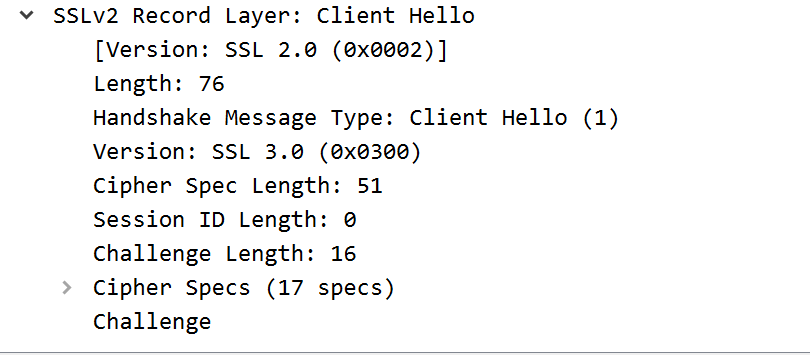

ps:
1. 可能wireshark版本问题，有些不对劲，不过凑合了解下就行了
2. 后半部分抄的作业，看了看解析，因为书上只是浅略讲了讲，对我来说也是不重要，如果以后用到了再学吧。

---
Answers:
1.  
前面是三次握手的报文，正好3个，估计这个属于他说的前8个帧吧
客户到服务器	1	Client Hello
服务器到客户	1	Server Hello
服务器到客户	2	Certificate, Server Hello Done
客户到服务器	3	Client Key Exchange, Change Cipher Spec, Encrypted Handshake Message
服务器到客户	3	Change Cipher Spec, Encrypted Handshake Message
2. 
Version	2B
Length	2B
Content Type 1B
3. 
4. 看不到这个值，不过看到这个属性名了
5. 
非对称：RSA
对称：RC4,DES,RC2
哈希：MD5,SHA,CBC
6. 
是，MD5
7. 0000000042dbed248b8831d04cc98c26e5badc4e267c391944f0f070ece57745, 防止重放攻击，提高安全性
8. 包含，如果SSL连接断开，再次连接时，可以使用该属性重新建立连接，在双方都有缓存的情况下可以省略握手的步骤。
9. 证书在单独的记录中，因为太长，不适合单独的以太网帧传输
10. 
11. 指示后面发送的消息都是加密过的。1字节
12. Encrypted Handshake Message
13. 发送了，没有不同
14. 使用上面协商的加密方法进行加密。应用中没有区分加密的应用程序数据和消息认证码MAC，因此我看不出来。
15. 第二次连接时，没有发送Client Key Exchange，可能是Seeeion ID的效果。
